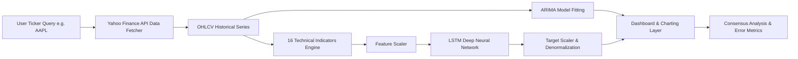

# StockVision — AI-Powered Stock Forecasting & Analytics

<div align="center">


<p align="center">
  <b>A financial analytics platform combining classical time-series forecasting (ARIMA) and deep learning neural networks (LSTM) with real-time technical indicators, consensus scorecards, and a portfolio simulator.</b>
</p>

</div>

---

## Overview

StockVision is an end-to-end web platform designed for stock market analysis and price forecasting. It integrates statistical modeling and deep learning to project asset prices across flexible forecast horizons while providing quantitative validation through backtesting and technical analysis.

---

## Key Features

- **Dual AI Forecasting Engine**:
  - **ARIMA(2,1,2)**: Statistical time-series model establishing baseline price directional trends and mean reversion.
  - **16-Feature Deep LSTM**: Multi-layer Recurrent Neural Network trained on technical indicators (`OHLCV`, `RSI14`, `MACD`, `Bollinger Bands`, `ATR14`, `Stochastic %K`, `SMAs`, `EMAs`) for non-linear pattern recognition.
- **Interactive Candlestick Charts**: High-performance Plotly visualizations supporting customizable forecast horizons (7, 14, 17, and 30 days).
- **Walk-Forward Backtesting Validation**: Overlays historical predictions against actual price history over the past 90 trading days to verify model accuracy visually.
- **Dynamic Quantitative Metrics**: Real-time evaluation reporting Mean Absolute Error (**MAE**), Root Mean Square Error (**RMSE**), and Mean Absolute Percentage Error (**MAPE**).
- **Consensus & Technical Reports**: Aggregated technical summary combining indicators and AI model signals into an interactive consensus gauge (`Strong Buy` to `Strong Sell`) with printable PDF support.
- **Paper Trading Portfolio Simulator**: Virtual trading environment initialized with $100,000 cash, real-time price synchronization, position tracking, P&L calculations, and persistent local storage.

---

## Technical Architecture & Workflow



### Data & Model Processing Pipeline

1. **Market Data Retrieval**: Fetches 2 years of daily historical market data via Yahoo Finance (`yfinance`).
2. **Feature Engineering**: Derives 16 momentum, trend, and volatility indicators (RSI, MACD, Bollinger Bands, ATR, Stochastic %K, SMAs, EMAs).
3. **Model Inference**:
   - **ARIMA**: Fits price levels dynamically and projects mean-reverting trend trajectories.
   - **LSTM**: Normalizes multi-feature inputs, predicts scaled daily percentage returns ($\Delta\%$), and inverse-transforms values to reconstruct target price series.
4. **Model Performance Evaluation**: Computes historical error metrics (MAE, RMSE, MAPE) on out-of-sample test windows.

---

## Repository Structure

```text
Stock-vision/
├── backend/                        # FastAPI High-Performance Backend
│   ├── main.py                     # API router, indicator calculations, ARIMA & LSTM inference
│   ├── requirements.txt            # Python dependencies
│   └── models/                     # Model weights & pre-trained scalers
│       ├── arima_universal.pkl     # Fitted ARIMA statistical model
│       ├── lstm_stock_model.h5     # Keras LSTM neural network model
│       ├── feature_scaler.pkl      # Feature MinMaxScaler (16 features)
│       └── target_scaler.pkl       # Target percentage return MinMaxScaler
│
└── frontend/                       # React + Vite Modern Frontend
    ├── src/
    │   ├── App.jsx                 # Core application container & route manager
    │   ├── colors.js               # Theme design system tokens
    │   ├── services/api.js         # HTTP Axios client layer
    │   └── components/
    │       ├── Navbar.jsx          # Primary navigation header
    │       ├── Sidebar.jsx         # Search controls & horizon selection
    │       ├── StockHeader.jsx     # Live ticker price header & quick metrics
    │       ├── ForecastChart.jsx   # Plotly candlestick & forecast visualizer
    │       ├── EvaluationMetrics.jsx # Model performance metric cards (MAE, RMSE, MAPE)
    │       ├── TechnicalIndicators.jsx # RSI, MACD, & Bollinger Bands charts
    │       ├── MarketsView.jsx     # Index overview & stock directory table
    │       ├── ReportsView.jsx     # Executive printable consensus report & gauge dial
    │       └── PortfolioView.jsx   # Virtual portfolio manager & transaction ledger
    ├── index.html                  # HTML template entry
    └── package.json                # Frontend package dependencies & scripts
```

---

## Installation & Setup

### Prerequisites

Ensure the following runtimes are installed on your environment:
- **Python**: Version 3.9 or higher
- **Node.js**: Version 18.0 or higher (with `npm`)

---

### Step 1: Clone Repository

```bash
git clone https://github.com/Pr4ba5/Stock-vision.git
cd Stock-vision
```

---

### Step 2: Backend Setup (FastAPI)

1. Navigate to the `backend` directory:
   ```bash
   cd backend
   ```

2. Create and activate a Python virtual environment:
   - **Linux / macOS**:
     ```bash
     python3 -m venv venv
     source venv/bin/activate
     ```
   - **Windows (PowerShell)**:
     ```powershell
     python -m venv venv
     .\venv\Scripts\Activate.ps1
     ```

3. Install required Python packages:
   ```bash
   pip install -r requirements.txt
   ```

4. Launch the FastAPI server:
   ```bash
   uvicorn main:app --reload --port 8000
   ```

   **Server Endpoints**:
   - API Base: `http://localhost:8000`
   - Health Check: `http://localhost:8000/api/health`
   - Interactive OpenAPI Documentation: `http://localhost:8000/docs`

---

### Step 3: Frontend Setup (React + Vite)

1. Open a new terminal session and navigate to the `frontend` directory:
   ```bash
   cd frontend
   ```

2. Install dependencies:
   ```bash
   npm install
   ```

3. Start the development server:
   ```bash
   npm run dev
   ```

4. Access the application in your browser at `http://localhost:5173`.

---

## Configuration & Environment Variables

The frontend relies on an environment variable for backend communications.

Create or verify `.env` in the `frontend/` directory:

```env
VITE_API_URL=http://localhost:8000
```

---

## API Reference

| Method | Endpoint | Parameters | Description |
|---|---|---|---|
| `GET` | `/api/health` | None | Returns backend runtime and model loading status. |
| `GET` | `/api/forecast` | `symbol` (string, required)<br>`days` (integer, default: 7) | Fetches market data, executes ARIMA & LSTM forecasts, computes backtests, indicators, and error metrics. |
| `GET` | `/api/markets` | None | Retrieves current prices and daily changes for major indices and monitored equities. |
| `GET` | `/api/prices` | `symbols` (comma-separated string) | Returns real-time closing prices for specified ticker symbols. |
| `GET` | `/api/search` | `q` (string, required) | Provides autocomplete suggestions for ticker symbols and company names. |

---

## Usage Guide

1. **Forecast Dashboard**:
   - Search for a valid equity symbol (e.g., `AAPL`, `NVDA`, `MSFT`, `TSLA`) or pick from quick selections.
   - Select the target forecast window (7, 14, 17, or 30 days).
   - Click **Generate Forecast** to load candlestick charts, model projections, and backtest results.
2. **Markets Overview**:
   - Monitor live indices (`SPY`, `QQQ`, `DIA`) and popular stocks with real-time price metrics.
   - Direct shortcut to launch forecasts for any listed stock.
3. **Consensus & Technical Reports**:
   - Review technical summary signals (RSI, MACD, Bollinger Bands) alongside ARIMA/LSTM projections.
   - Export or print comprehensive PDF reports with an interactive consensus score dial.
4. **Paper Trading Portfolio**:
   - Manage a virtual $100,000 cash account with real-time mark-to-market valuations.
   - Execute mock order entries (Buy/Sell) with automated P&L calculations.

---

## Disclaimer

StockVision is built strictly for **educational, analytical, and technical research purposes**. Financial markets involve substantial risk. Projections generated by quantitative models and neural networks must not be relied upon as financial or investment advice. Always conduct independent research and verify data prior to executing real financial transactions.

---

## License

This repository is licensed under the [MIT License](LICENSE).
