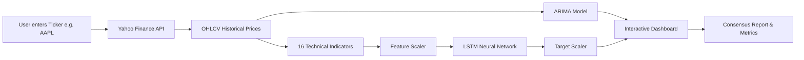

# 📈 StockVision — AI-Powered Stock Forecasting & Analytics

<div align="center">


<p align="center">
  <b>An intelligent financial analytics platform combining classical time-series forecasting (ARIMA) and deep learning neural networks (LSTM) with real-time technical indicators and a portfolio simulator.</b>
</p>

</div>

---

## 🌟 Key Features

- **🤖 Dual AI Forecasting Engine**:
  - **ARIMA(2,1,2)**: Statistical time-series model for baseline price direction and trend stability.
  - **16-Feature Deep LSTM**: Multi-layer neural network trained on technical indicators (`OHLCV`, `RSI14`, `MACD`, `Bollinger Bands`, `ATR14`, `Stochastic %K`, `SMAs`, `EMAs`) for non-linear pattern recognition.
- **📊 Interactive Candlestick Charts**: High-performance Plotly charts with customizable forecast horizons (7, 14, 17, 30 days).
- **📈 Honest Walk-Forward Backtesting**: Overlays historical predictions over the last 90 trading days to visually verify model accuracy.
- **🎯 Dynamic Model Metrics**: Live **MAE** (Mean Absolute Error), **RMSE** (Root Mean Square Error), and **MAPE** (Mean Absolute Percentage Error) calculated from actual historical test data.
- **📄 Printable Consensus Reports**: Comprehensive technical breakdown report complete with an interactive consensus gauge dial (`Strong Buy` → `Strong Sell`) and PDF printing support.
- **💼 Portfolio Simulator**: Risk-free mock stock trading environment with $100,000 virtual cash, live price syncing, P&L tracking, and persistent browser storage.

---

## 🧠 How It Works (Simple Explanation)



1. **Data Fetching**: Real-time 2-year daily stock price history is fetched live from Yahoo Finance.
2. **Feature Engineering**: Calculates 16 key momentum, volatility, and trend technical indicators.
3. **AI Inference**:
   - **ARIMA** transfers fitted statistical parameters directly to current closing prices using state transformation (`model.apply()`).
   - **LSTM** scales input features, predicts scaled daily percentage returns ($\Delta\%$), and inverse-transforms them to reconstruct predicted prices anchored to the latest real closing rate.
4. **Validation**: Computes error metrics between past predictions and actual prices to highlight the better-performing model.

---

## 🚀 Step-by-Step Installation Guide

No advanced technical background required! Follow these simple steps to run StockVision on your computer.

### 📋 Prerequisites

Make sure you have installed:
1. **Python** (version 3.9 or higher) — [Download Python](https://www.python.org/downloads/)
2. **Node.js** (version 18 or higher) — [Download Node.js](https://nodejs.org/)

---

### Step 1: Download or Clone the Project

Open your Terminal (Mac/Linux) or Command Prompt/PowerShell (Windows) and run:

```bash
git clone https://github.com/Pr4ba5/Stock-vision.git
cd Stock-vision
```

---

### Step 2: Set Up the Backend Server

Open your terminal in the `Stock-vision` folder and run:

#### Windows:
```powershell
cd backend
pip install -r requirements.txt
python -m uvicorn main:app --reload --port 8000
```

#### macOS / Linux:
```bash
cd backend
pip3 install -r requirements.txt
python3 -m uvicorn main:app --reload --port 8000
```

✅ **Backend Server Running!**
- API URL: `http://localhost:8000`
- Live Health Check: `http://localhost:8000/api/health`
- Interactive API Docs: `http://localhost:8000/docs`

---

### Step 3: Set Up the Frontend Dashboard

Keep the backend running! Open a **second terminal window**, navigate to the `Stock-vision` folder, and run:

```bash
cd frontend
npm install
npm run dev
```

✅ **Frontend App Running!**
- Open your browser and go to: **`http://localhost:5173`**

---

## 🎮 How to Use StockVision

1. **Dashboard Tab**:
   - Enter a stock symbol (e.g., `AAPL`, `TSLA`, `NVDA`, `GOOGL`, `MSFT`) in the left sidebar or select from quick-picks.
   - Choose your desired forecast horizon (7, 14, 17, or 30 days).
   - Click **⚡ Generate Forecast**.
   - Hover over the chart to inspect candlestick wicks, ARIMA projections, LSTM curves, and past backtest lines.

2. **Markets Tab**:
   - View live performance, daily price changes, highs, and lows for major indices (`SPY`, `QQQ`, `DIA`) and popular equities.
   - Click **Forecast** on any stock to jump directly to its predictions.

3. **Reports Tab**:
   - View an executive consensus scorecard summarizing technical indicators (RSI, MACD, Bollinger Bands) and AI model targets.
   - Includes a visual **Rating Dial** (`Strong Buy` → `Strong Sell`) and a **Print / Save PDF** button.

4. **Portfolio Tab**:
   - Test your trading strategies with a virtual $100,000 balance.
   - Execute mock Buy/Sell transactions with real-time price synchronization.
   - Track total return, unrealized P&L, and transaction logs (automatically saved in your browser).

---

## 📁 Project Structure

```text
Stock-vision/
├── backend/                        # FastAPI Backend Engine
│   ├── main.py                     # API routes, indicator algorithms, ARIMA & LSTM inference
│   ├── requirements.txt            # Python package dependencies
│   └── models/                     # Trained Model & Deployment Scaler Artifacts
│       ├── arima_universal.pkl     # Fitted ARIMA model object
│       ├── lstm_stock_model.h5     # Trained Keras LSTM neural network
│       ├── feature_scaler.pkl      # MinMaxScaler for 16 input features
│       └── target_scaler.pkl       # MinMaxScaler for target % change
│
└── frontend/                       # React + Vite User Interface
    ├── src/
    │   ├── App.jsx                 # Core app container & layout
    │   ├── colors.js               # Dark-mode design system token palette
    │   ├── services/api.js         # HTTP client API service
    │   └── components/
    │       ├── Navbar.jsx          # Top application navigation bar
    │       ├── Sidebar.jsx         # Search drawer & forecast controls
    │       ├── StockHeader.jsx     # Live ticker price & metadata header
    │       ├── ForecastChart.jsx   # Plotly candlestick + forecast overlay chart
    │       ├── EvaluationMetrics.jsx # Real MAE, RMSE, MAPE model evaluation cards
    │       ├── TechnicalIndicators.jsx # RSI, MACD, & Bollinger Bands charts
    │       ├── MarketsView.jsx     # Market overview & index table
    │       ├── ReportsView.jsx     # Executive printable consensus report & dial
    │       └── PortfolioView.jsx   # Paper trading simulator & portfolio tracker
    ├── index.html                  # HTML entry point
    └── package.json                # Node.js dependencies & scripts
```

---

## 🔌 API Endpoints Reference

| Method | Endpoint | Parameters | Description |
|---|---|---|---|
| `GET` | `/api/health` | None | Non-blocking system health check & model status |
| `GET` | `/api/forecast` | `symbol` (str), `days` (int) | Fetches historical OHLCV data, runs ARIMA & LSTM forecasts, computes backtests, indicators, & error metrics |
| `GET` | `/api/markets` | None | Returns daily quotes for top market indices and popular stocks |
| `GET` | `/api/prices` | `symbols` (comma-separated str) | Returns latest closing prices for specified ticker symbols |
| `GET` | `/api/search` | `q` (str) | Autocomplete stock ticker and company name search |

---

## 🛡️ Disclaimer

StockVision is designed solely for **educational, academic, and technical demonstration purposes**. Financial markets are complex and inherently unpredictable. Model predictions generated by statistical algorithms or neural networks should **never** be interpreted as financial or investment advice. Always conduct independent research before investing.

---

## 📄 License

This project is open-source under the [MIT License](LICENSE).
